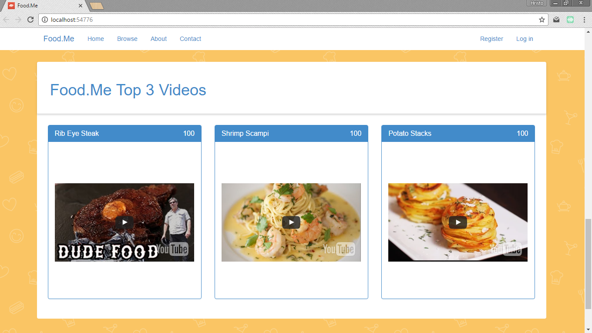

# When It's Done

## [Video](https://www.youtube.com/watch?v=Paj13NTirw8)

## Food.Me

  - WebFormMvp - [link](https://github.com/webformsmvp/webformsmvp)
  - Ninject - [link](https://github.com/ninject)
  - Bytes2You - [link](https://github.com/veskokolev/Bytes2you.Validation)

## Home page
  - MVP + repository - [link](https://github.com/army-of-two/when-its-done/blob/master/WhenItsDone/Clients/WhenItsDone.WebFormsClient/ViewControls/ContentContainers/TopDishesUserControl.ascx.cs)
  - EntityDataSource - [link](https://github.com/army-of-two/when-its-done/blob/master/WhenItsDone/Clients/WhenItsDone.WebFormsClient/ViewControls/ContentContainers/TopUsersUserControl.ascx) 
  - SqlDataSource - [link](https://github.com/army-of-two/when-its-done/blob/master/WhenItsDone/Clients/WhenItsDone.WebFormsClient/ViewControls/ContentContainers/TopVideoItemsUserControl.ascx)

## Browse page
  - MVP + IQueryable service - [link](https://github.com/army-of-two/when-its-done/blob/master/WhenItsDone/Clients/WhenItsDone.WebFormsClient/Browse.aspx.cs)

